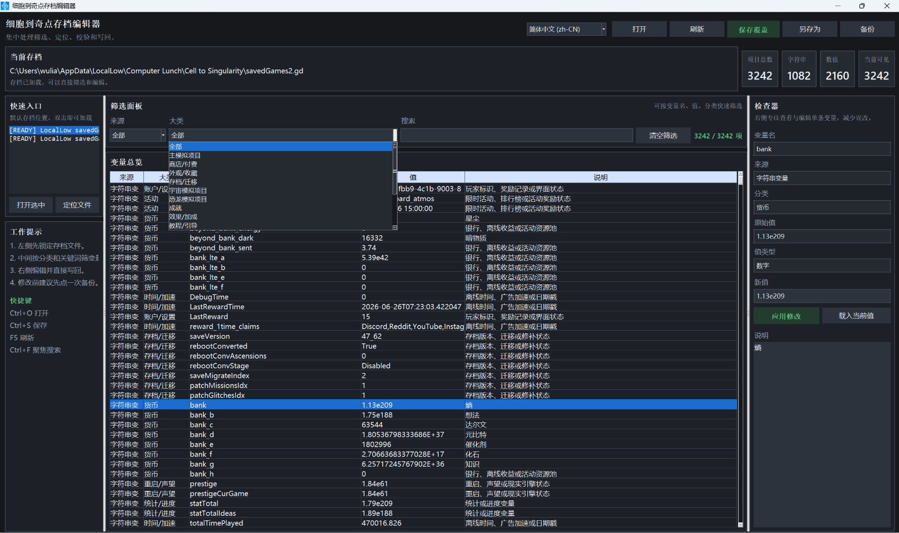

# 细胞到奇点存档编辑器

一个**Cell to Singularity 存档编辑器**，用于查看、筛选、编辑、备份并写回游戏存档变量。

[English](./README.md) | 简体中文



## ✨ 功能特性

- 📂 自动定位并打开存档目录，提供快速访问入口
- 🔍 区分字符串变量与数值变量，便于分析与定位
- 🧩 支持按关键词、来源、分类进行筛选
- 📚 内置常见变量分类与说明
- 🛠️ 右侧检查器支持变量查看与编辑
- 💾 支持覆盖保存、另存为及自动备份
- 🌐 多语言支持（简体中文 / English）
- 🔄 自动更新检测

## ⚠️ IMPORTANT

> 在编辑存档前**务必进行备份**。
>
> 虽然程序内置备份功能，但**建议将备份文件存放在游戏存档目录之外**，以避免意外覆盖或损坏。

## 🔄 更新配置

可以通过环境变量自定义更新源：

```powershell
$env:CTS_UPDATE_JSON_URL="http://cdn.maxing.site/update/app/cts_save_editor.json"
```

## 📄 更新 JSON 格式

更新接口需要返回如下结构：

```json
{
  "version": "0.1.0",
  "title": "CTS Save Editor 0.1.0",
  "download_url": "https://github.com/Wulian233/CTS-Save-Editor/releases/latest",
  "changelog": {
    "zh-CN": "- 初次发布",
    "en-US": "- Initial release"
  }
}
```
