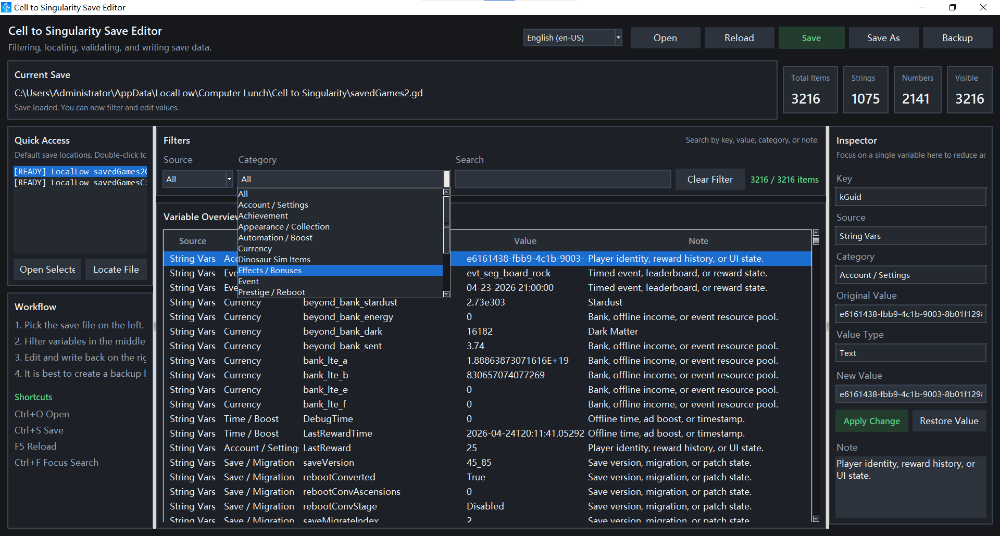

# Cell to Singularity Save Editor

A **save editor for Cell to Singularity** written in Python. It allows you to view, filter, edit, back up, and write back save variables.

English | [简体中文](./README-cn.md)



## ✨ Features

- 📂 Automatically locates and opens the save directory with quick access shortcuts
- 🔍 Distinguishes between string and numeric variables for easier analysis and navigation
- 🧩 Supports filtering by keyword, source, and category
- 📚 Provides built-in classifications and descriptions for many known variables
- 🛠️ Inspect and edit selected variables in the right-side panel
- 💾 Supports overwrite save, save as, and automatic backups
- 🌐 Multi-language support (Simplified Chinese / English)
- 🔄 Automatic update checking

## ⚠️ IMPORTANT

> **Always back up your save files before editing.**
>
> Although the program includes a backup feature, it is strongly recommended to store backups **outside the game’s save directory** to prevent accidental overwrites or corruption.

## 🔄 Update Configuration

You can customize the update source via an environment variable:

```powershell
$env:CTS_UPDATE_JSON_URL="http://cdn.maxing.site/update/app/cts_save_editor.json"
```

## 📄 Update JSON Format

The update endpoint should return data in the following structure:

```json
{
  "version": "0.1.0",
  "title": "CTS Save Editor 0.1.0",
  "download_url": "https://github.com/Wulian233/CTS-Save-Editor/releases/latest",
  "changelog": {
    "zh-CN": "- 初次发布",
    "en-US": "- Initial release"
  }
}
```

### Validation Rules

The program will **ignore update prompts and continue to start normally** in the following cases:

- Request fails (network error)
- Invalid response format
- Missing `download_url`
- `version` is not higher than the current version
